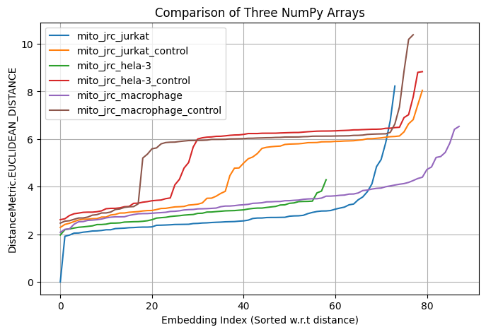
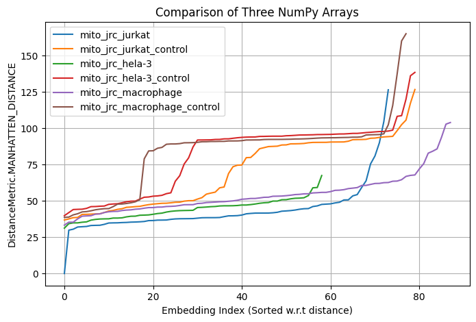
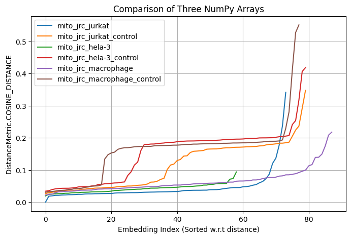

# PowerHouseDINO
A Repository for examining Mitochondrial UltraStructures using DINOv3.

This repository containes code for examining Mitochondrial Ultrastructures from EM using DINOv3. We use the [OpenOrganelle repository](https://openorganelle.janelia.org/organelles/mito) repository for our data and DINOv3 as our model.

# Task 1
Task 1 Answers can be found [here](./task1_review.md)

# Requirements
Note that this version of the code needs [python>=3.10](https://www.python.org/downloads/release/python-3100/)
# Usage
## Cloning
clone the repos as follows:
```
git clone --recursive https://github.com/AtharvMane/PowerHouseDINO.git
```
This repository uses [DINOv3](https://github.com/facebookresearch/dinov3.git) as a submodule. The recursive clone will also clone the DINOv3 submodule. If you have already cloned the repository and the `dinov3/` folder is empty, use:
```
git submodule update --init --recursive\
```

## Initialization and Dependency installation
run the following:
```
cd dinov3/
pip3 install -U -r requirements.txt
pip3 install -U -r requirements-dev.txt
pip3 install -e .
cd ..
pip3 install -U -r requirements.txt
```

## Datset Download anf Generation
To download anf generate mitochondrial data locally run:
```
python3.10 get_datasets.py
```
This script will populate the `datasets/` folder witj `.npy` files containing image slices taken from a single `Y-Slice` in the very middle of the datasets provided in the `DATASET_LINKS` field in `config.py`. For each dataset 3 kinds of files are created. A type of files that contain mitochondrion at the center (`{dataset_name}_image_slices.npy`), another type that contain the segmentation maps (`{dataset_name}_seg_slices.npy`), and files containing a set of random slices of the single `Y-Slice` from each dataset (`{dataset_name}_control_image_slices.npy`). More datasets can be added, the size of images in each datasets can be changed and the number of control images can be changed by changing the fields in ```config.py```


## Embeddings, inter-embedding distance
Now, to get embeddings, run:
```
python3.10 get_embeddings.py
```
This script runs a the dinov3 model on each image in each dataset and its control set. Thus it results in N*2 different (@, positive and control, each for a given dataset) embeddings which are then populated in the `embeddings/` folder as `.pth` files. After this, it also calculates a `distance` metric between a query vector, (the `cls_token` of the first dataset) and every other dataset. Then plots the obtained `distance_metric` on a `matplotlib` plot as well as saved to `{distance_type}.png
All the hyperparameters, including the batch_size, applied transforms, effective patch size, distance metric, as well as accelerating device can be found in `config.py`.

## Results
We got the following results from our studies:
<table style="width: 100%; border-collapse: collapse;">
  <tr>
    <td style="width: 50%;"></td>
    <td style="width: 50%;"></td>
  </tr>
  <tr>
    <td colspan="2" align="center">
      
    </td>
  </tr>
</table>

As can be seen in the figures, the general distance for `positive datasets` is quite comparatively lower than the `control datasets`. This shows that even without finetuning, the `DINOv3` retains some 'similarity based understanding of the data.

## Result improvements
We can use this property to improve the model using Self Supervised Learning with a dual finetuning pipeline.
### Domain Adaptation
- Masked image modelling for domain adaptaion for dense classification.
    - Sample N random Samples from the datasets. Mask each sample by 60% to 70%. Make the model predict the output pixels.
- Similarity based Self Superwised learning for global classification.
    - Select N centroids at a given X/Y/Z-Scale. Sample images around this centroid thresholded to a shifted distance of `T`(TBD empirically). All these samples belong to the same class (since theyre approximately from the same `locality`)

### Finetuning
- After domain adaptation. Finetune on only a very small subset of segmentation and global classification data using direct supervised learning.


# Documentation
A more detailed documentation is given at [documentation.md](./documentation.md)
